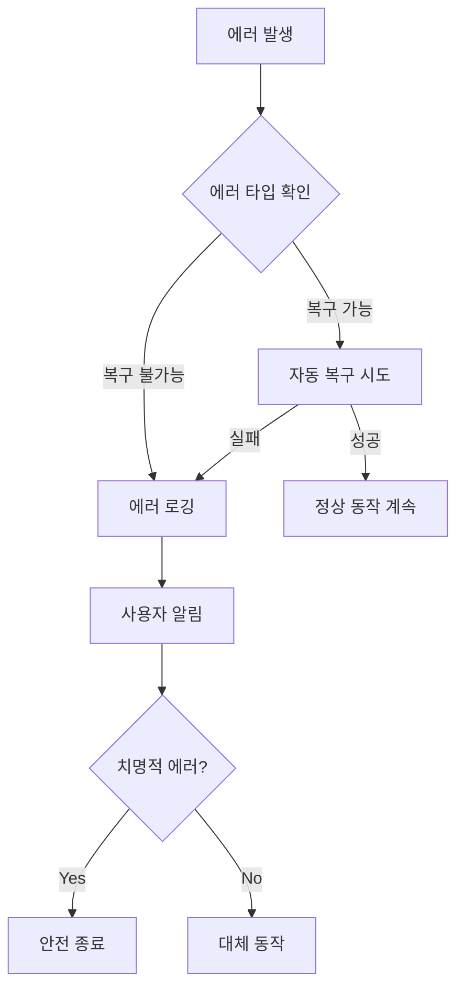

# WebPrinter 리팩토링 설계 문서

## 개요

WebPrinter 프로젝트의 코드 구조를 개선하고 유지보수성을 향상시키기 위한 종합적인 리팩토링 설계입니다. 현재의 단일 파일 구조를 모듈화하고, 중복 코드를 제거하며, 테스트 가능한 구조로 변경합니다.

## 아키텍처

### 현재 구조의 문제점
```
현재 구조:
├── main.js (800+ 라인, 모든 로직 포함)
├── preload.js
├── print-preview.html/js
├── index.html (중복)
├── web-example.html (중복)
└── package.json
```

### 개선된 구조
```
새로운 구조:
├── src/
│   ├── main/
│   │   ├── index.js (진입점)
│   │   ├── app/
│   │   │   ├── AppManager.js
│   │   │   ├── WindowManager.js
│   │   │   └── UpdateManager.js
│   │   ├── protocol/
│   │   │   ├── ProtocolHandler.js
│   │   │   └── UrlParser.js
│   │   ├── server/
│   │   │   ├── HttpServer.js
│   │   │   ├── routes/
│   │   │   └── middleware/
│   │   ├── session/
│   │   │   ├── SessionManager.js
│   │   │   └── SessionStorage.js
│   │   ├── printer/
│   │   │   ├── PrinterManager.js
│   │   │   └── PrintJobHandler.js
│   │   └── utils/
│   │       ├── Logger.js
│   │       ├── Config.js
│   │       └── ErrorHandler.js
│   ├── renderer/
│   │   ├── print-preview/
│   │   │   ├── index.html
│   │   │   ├── renderer.js
│   │   │   └── styles.css
│   │   └── shared/
│   │       ├── api.js
│   │       ├── utils.js
│   │       └── components/
│   ├── preload/
│   │   ├── print-preview.js
│   │   └── shared.js
│   └── web/
│       ├── production/
│       │   └── index.html (최종 사용자용)
│       └── development/
│           ├── index.html (개발자용)
│           └── examples/
├── config/
│   ├── default.json
│   ├── development.json
│   ├── production.json
│   └── schema.json
├── tests/
│   ├── unit/
│   ├── integration/
│   └── e2e/
├── docs/
│   ├── api/
│   ├── architecture/
│   └── deployment/
└── scripts/
    ├── build.js
    ├── test.js
    └── dev.js
```

## 컴포넌트 및 인터페이스

### 1. 메인 프로세스 모듈

#### AppManager
```javascript
class AppManager {
  constructor(config, logger)
  async initialize()
  async shutdown()
  getStatus()
}
```

**책임:**
- 애플리케이션 생명주기 관리
- 전역 상태 관리
- 의존성 주입 컨테이너 역할

#### WindowManager
```javascript
class WindowManager {
  constructor(config, logger)
  async createPrintWindow(sessionId)
  async showWindow(windowId)
  async hideWindow(windowId)
  closeAllWindows()
}
```

**책임:**
- BrowserWindow 생성 및 관리
- 창 상태 관리
- IPC 통신 설정

#### ProtocolHandler
```javascript
class ProtocolHandler {
  constructor(config, logger)
  registerProtocol()
  handleProtocolCall(url)
  parseProtocolUrl(url)
}
```

**책임:**
- 커스텀 프로토콜 등록
- 프로토콜 URL 파싱
- 프로토콜 호출 처리

#### HttpServer
```javascript
class HttpServer {
  constructor(config, logger)
  async start()
  async stop()
  addRoute(method, path, handler)
  addMiddleware(middleware)
}
```

**책임:**
- Express 서버 관리
- 라우트 등록
- 미들웨어 관리

#### SessionManager
```javascript
class SessionManager {
  constructor(storage, logger)
  createSession(sessionId)
  getSession(sessionId)
  updateSession(sessionId, data)
  cleanExpiredSessions()
}
```

**책임:**
- 세션 생명주기 관리
- 세션 데이터 검증
- 세션 정리

### 2. 설정 관리 시스템

#### Config 클래스
```javascript
class Config {
  constructor(environment)
  get(key, defaultValue)
  validate()
  reload()
}
```

**설정 구조:**
```json
{
  "app": {
    "name": "WebPrinter",
    "version": "1.4.1",
    "autoLaunch": true
  },
  "server": {
    "portRange": [18731, 18740],
    "cors": {
      "origin": "*",
      "credentials": true
    }
  },
  "window": {
    "width": 1000,
    "height": 800,
    "minWidth": 800,
    "minHeight": 600
  },
  "session": {
    "maxAge": 86400000,
    "cleanupInterval": 3600000
  },
  "logging": {
    "level": "info",
    "file": "webprinter.log",
    "maxSize": "10MB",
    "maxFiles": 5
  }
}
```

### 3. 로깅 및 에러 처리

#### Logger 클래스
```javascript
class Logger {
  constructor(config)
  debug(message, meta)
  info(message, meta)
  warn(message, meta)
  error(message, meta)
  createChild(module)
}
```

**로그 형식:**
```json
{
  "timestamp": "2025-01-30T10:30:00.000Z",
  "level": "info",
  "module": "HttpServer",
  "message": "Server started",
  "meta": {
    "port": 18731,
    "sessionId": "abc123"
  }
}
```

#### ErrorHandler 클래스
```javascript
class ErrorHandler {
  constructor(logger)
  handleError(error, context)
  createError(code, message, details)
  isRecoverable(error)
}
```

**에러 코드 체계:**
```javascript
const ErrorCodes = {
  // 시스템 에러 (1000-1999)
  SYSTEM_STARTUP_FAILED: 1001,
  SYSTEM_SHUTDOWN_FAILED: 1002,
  
  // 네트워크 에러 (2000-2999)
  SERVER_START_FAILED: 2001,
  PORT_IN_USE: 2002,
  
  // 프로토콜 에러 (3000-3999)
  PROTOCOL_REGISTRATION_FAILED: 3001,
  INVALID_PROTOCOL_URL: 3002,
  
  // 세션 에러 (4000-4999)
  SESSION_NOT_FOUND: 4001,
  SESSION_EXPIRED: 4002,
  
  // 인쇄 에러 (5000-5999)
  PRINTER_NOT_FOUND: 5001,
  PRINT_JOB_FAILED: 5002
};
```

## 데이터 모델

### Session 모델
```javascript
class Session {
  constructor(id) {
    this.id = id;
    this.createdAt = new Date();
    this.updatedAt = new Date();
    this.expiresAt = new Date(Date.now() + 24 * 60 * 60 * 1000);
    this.urls = {
      preview: null,
      print: null
    };
    this.paperSize = {
      width: null,
      height: null,
      name: 'Custom'
    };
    this.status = 'created'; // created, active, completed, expired
  }
  
  isExpired() {
    return new Date() > this.expiresAt;
  }
  
  update(data) {
    this.updatedAt = new Date();
    Object.assign(this, data);
  }
  
  validate() {
    // 데이터 검증 로직
  }
}
```

### PrintJob 모델
```javascript
class PrintJob {
  constructor(sessionId, options) {
    this.id = generateId();
    this.sessionId = sessionId;
    this.url = options.url;
    this.printerName = options.printerName;
    this.copies = options.copies || 1;
    this.paperSize = options.paperSize;
    this.status = 'pending'; // pending, processing, completed, failed
    this.createdAt = new Date();
    this.error = null;
  }
}
```

## 에러 처리

### 에러 처리 전략
1. **계층별 에러 처리**
   - 각 모듈에서 자체 에러 처리
   - 상위 계층으로 구조화된 에러 전달
   - 최상위에서 통합 에러 처리

2. **복구 가능한 에러**
   - 자동 재시도 메커니즘
   - 대체 동작 수행
   - 사용자에게 복구 방법 제시

3. **치명적 에러**
   - 안전한 종료 절차
   - 에러 리포팅
   - 복구 불가능 상태 알림

### 에러 처리 플로우


## 테스트 전략

### 1. 단위 테스트
- **대상:** 각 클래스와 함수
- **도구:** Jest
- **커버리지:** 80% 이상
- **모킹:** 외부 의존성 모킹

### 2. 통합 테스트
- **대상:** 모듈 간 상호작용
- **시나리오:** 실제 사용 케이스
- **환경:** 테스트 전용 환경

### 3. E2E 테스트
- **대상:** 전체 워크플로우
- **도구:** Spectron 또는 Playwright
- **시나리오:** 사용자 관점 테스트

### 테스트 구조
```
tests/
├── unit/
│   ├── main/
│   │   ├── AppManager.test.js
│   │   ├── SessionManager.test.js
│   │   └── HttpServer.test.js
│   └── utils/
│       ├── Config.test.js
│       └── Logger.test.js
├── integration/
│   ├── protocol-handling.test.js
│   ├── session-management.test.js
│   └── print-workflow.test.js
└── e2e/
    ├── basic-printing.test.js
    └── error-scenarios.test.js
```

## 성능 최적화

### 1. 시작 시간 최적화
- **지연 로딩:** 필요한 모듈만 초기 로드
- **병렬 초기화:** 독립적인 컴포넌트 병렬 시작
- **캐싱:** 설정 및 메타데이터 캐싱

### 2. 메모리 최적화
- **세션 정리:** 만료된 세션 자동 정리
- **이벤트 리스너 정리:** 메모리 누수 방지
- **윈도우 관리:** 사용하지 않는 윈도우 정리

### 3. 네트워크 최적화
- **연결 풀링:** HTTP 연결 재사용
- **요청 압축:** gzip 압축 적용
- **타임아웃 설정:** 적절한 타임아웃 값

## 보안 강화

### 1. 입력 검증
```javascript
const ValidationSchema = {
  session: {
    type: 'string',
    pattern: '^[a-zA-Z0-9_-]+$',
    maxLength: 64
  },
  url: {
    type: 'string',
    format: 'uri',
    protocol: ['http', 'https']
  },
  paperSize: {
    type: 'object',
    properties: {
      width: { type: 'number', minimum: 10, maximum: 1000 },
      height: { type: 'number', minimum: 10, maximum: 1000 }
    }
  }
};
```

### 2. 접근 제어
- **CORS 설정:** 허용된 도메인만 접근
- **Rate Limiting:** 요청 빈도 제한
- **Path Traversal 방지:** 파일 경로 검증

### 3. 보안 헤더
```javascript
const securityHeaders = {
  'X-Content-Type-Options': 'nosniff',
  'X-Frame-Options': 'DENY',
  'X-XSS-Protection': '1; mode=block',
  'Strict-Transport-Security': 'max-age=31536000'
};
```

## 빌드 및 배포

### 빌드 프로세스
```javascript
// scripts/build.js
const buildConfig = {
  target: process.env.NODE_ENV || 'production',
  platforms: ['win32', 'darwin'],
  exclude: [
    'src/web/development/**',
    'tests/**',
    'docs/**',
    '*.test.js'
  ],
  minify: true,
  sourcemap: false
};
```

### 배포 전략
1. **스테이징 배포**
   - 자동 테스트 실행
   - 성능 벤치마크
   - 보안 스캔

2. **프로덕션 배포**
   - 점진적 롤아웃
   - 모니터링 강화
   - 롤백 준비

## 모니터링 및 진단

### 헬스체크 엔드포인트
```javascript
// GET /health
{
  "status": "healthy",
  "timestamp": "2025-01-30T10:30:00.000Z",
  "version": "1.4.1",
  "uptime": 3600,
  "memory": {
    "used": 45.2,
    "total": 100.0,
    "unit": "MB"
  },
  "sessions": {
    "active": 5,
    "total": 23
  },
  "server": {
    "port": 18731,
    "status": "running"
  }
}
```

### 메트릭 수집
- **성능 메트릭:** 응답 시간, 처리량
- **에러 메트릭:** 에러 발생률, 에러 타입
- **비즈니스 메트릭:** 인쇄 성공률, 세션 수

## 마이그레이션 계획

### 단계별 마이그레이션
1. **1단계:** 설정 관리 및 로깅 시스템
2. **2단계:** 메인 프로세스 모듈화
3. **3단계:** 웹 인터페이스 정리
4. **4단계:** 테스트 코드 추가
5. **5단계:** 성능 최적화 및 보안 강화

### 호환성 유지
- 기존 API 엔드포인트 유지
- 프로토콜 URL 형식 유지
- 설정 파일 자동 마이그레이션